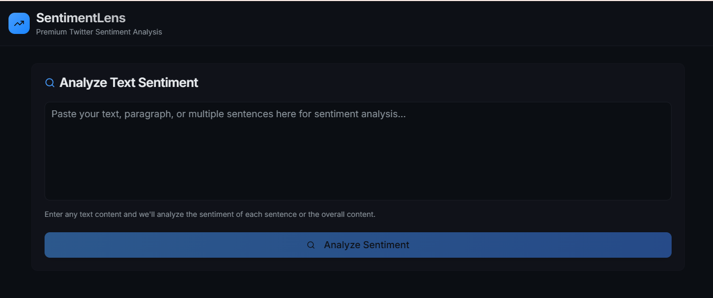
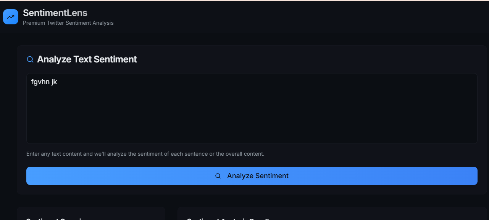
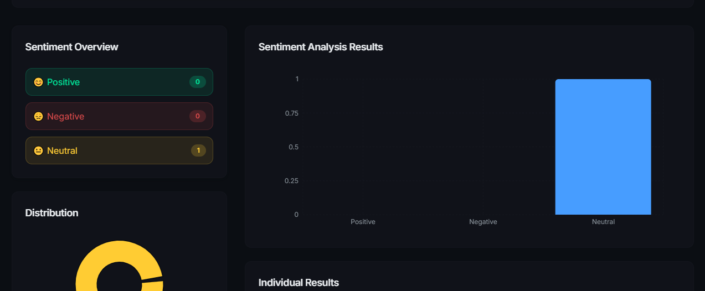
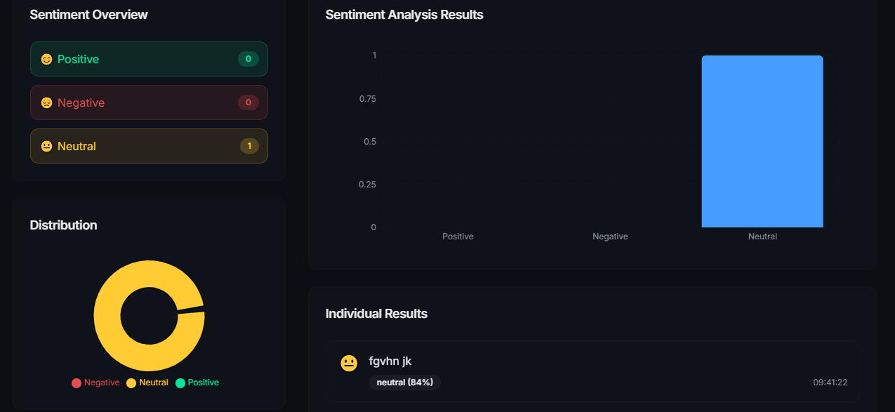

# SentimentLens 🚀

Premium Twitter Sentiment Analysis Web App

---

## ✨ Overview
SentimentLens is a sleek, modern web application for analyzing the sentiment of Twitter content. Enter tweet text, hashtags, or handles to get instant sentiment analysis (positive, negative, neutral) with interactive visualizations and a beautiful, premium UI.

---

## 🌟 Features
- 🌓 Minimal, premium UI with dark & light mode
- 📱 Responsive design powered by Bootstrap
- 📝 Input for tweet text, hashtags, or handles
- 📊 Interactive sentiment charts (Chart.js)
- 🧑‍💻 Individual sentiment results per sentence
- ⚡ Smooth transitions, loading states, and error handling
- 🎨 Custom-styled components for a SaaS look

---

## 🖼️ UI Preview
Here’s how SentimentLens looks in action:

| Analyze Text Sentiment | Sentiment Overview & Results |
|:----------------------:|:---------------------------:|
|  |  |
|  |  |

---

## 🚀 Getting Started
1. **Clone the repository:**
   ```bash
   git clone https://github.com/Priyanshi-Solanki/Sentiment_Lens.git
   ```
2. **Open the `final twitter` folder.**
3. **Open `index.html` in your browser.**

---

## 📂 File Structure
- `index.html` — Main HTML file
- `style.css` — Custom styles
- `script.js` — App logic
- `Capture*.PNG` — UI reference screenshots

---

## 🛠️ Customization
- You can improve the UI or add real Twitter API integration later.
- All code is in separate files for easy editing.

---

## 📄 License
MIT

---

> Made with ❤️ by Priyanshi-Solanki
